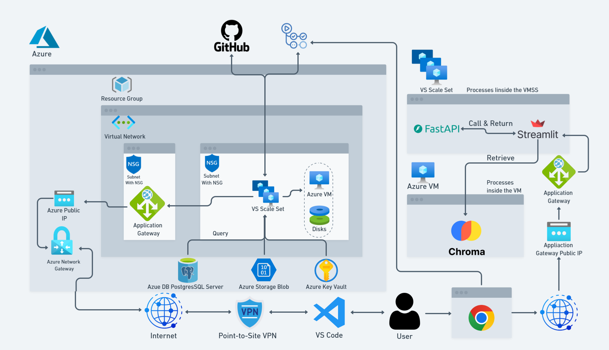

# 🤖 Scalable & Secure AI Chatbot Deployment on Azure (Terraform IaC)

Welcome to the official repository for our SDA Bootcamp project — a **cloud-native, production-ready AI chatbot** deployed on **Microsoft Azure** using **Terraform** and DevOps best practices.

## 📌 Project Overview

This project demonstrates the deployment of a scalable, secure, and modular AI chatbot system using Infrastructure as Code (IaC). It includes:

- Streamlit frontend
- FastAPI (Uvicorn) backend
- ChromaDB for vector embeddings
- PostgreSQL for chat history
- Azure Blob Storage for documents (PDFs)

## 🧱 Architecture

- **Terraform** for infrastructure automation (modular setup)
- **Azure Virtual Machine Scale Sets (VMSS)** for auto-scaling frontend and backend
- **Azure VM** for dedicated ChromaDB instance
- **Azure PostgreSQL** for structured chat data
- **Azure Blob Storage** for user-uploaded PDFs
- **Azure Key Vault** for managing secrets securely
- **Azure Application Gateway** with custom domain & SSL
- **Azure VPN Gateway** for secure SSH (private IP only)
- **GitHub Actions** for CI/CD automation

 *(Add your own diagram if available)*

## 🔧 Technologies Used

- **Terraform** (IaC)
- **Azure Cloud** (VMSS, VM, Networking, Key Vault, Gateway, Storage)
- **Streamlit** (Frontend)
- **FastAPI** + **Uvicorn** (Backend API)
- **ChromaDB** (Vector DB)
- **PostgreSQL**
- **Azure Blob Storage**
- **Git & GitHub**
- **GitHub Actions**
- **SSL / HTTPS / Custom Domain**

## 🚀 Deployment Steps

> ⚠️ Prerequisites:
> - Azure subscription
> - Terraform CLI
> - Git
> - GitHub repository with GitHub Actions enabled

1. **Clone the Repository**
   ```bash
   git clone https://github.com/saleem-td/Terraform_6.5.git
   cd Terraform_6.5
